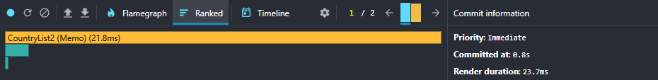

# RS School React Course 2025 — Task: Performance

This app implements the “Performance in React” assignment from [RS School](https://rs.school/).

## Local setup

The project uses `pnpm` (recommended) but is compatible with `npm`.

1. Clone the repo:

```bash
git clone https://github.com/Zilusion/rs-react-2025.git
cd rs-react-2025
```

2. Switch to the working branch:

```bash
git checkout performance
```

3. Install dependencies:

- pnpm

```bash
pnpm install
```

- npm

```bash
npm install
```

4. Start the dev server:

- pnpm

```bash
pnpm dev
```

- npm

```bash
npm run dev
```

## Available scripts

- `pnpm dev` / `npm run dev` — development mode
- `pnpm build` / `npm run build` — production build
- `pnpm check` / `npm run check` — code quality checks
- `pnpm fix` / `npm run fix` — auto-fixes

---

## Scenarios

1. **Sorting a column** — sort by name and by population (for the selected year)
2. **Searching for a country** — type a substring into the search field
3. **Selecting a year** — switch the year (the table flashes on year change)
4. **Adding/removing columns** — open the modal and toggle a couple of extra columns

## Results: before optimization

| Scenario                | Commit duration (ms) | Max render (ms) |
| ----------------------- | -------------------: | --------------: |
| Sorting a column        |                 1800 |             248 |
| Searching for a country |                 2600 |             188 |
| Selecting a year        |                 3300 |             208 |
| Adding/removing columns |                 1100 |             192 |

**Screenshots**

- Sorting — Flame / Ranked
  
  

- Search — Flame / Ranked
  
  

- Year — Flame / Ranked
  
  

- Columns — Flame / Ranked
  
  

## Results: after optimization

| Scenario                | Commit duration (ms) | Max render (ms) | Δ vs before                                            |
| ----------------------- | -------------------: | --------------: | :----------------------------------------------------- |
| Sorting a column        |                  800 |              21 | Commit **−1000 ms** (−55.6%), Max **−227 ms** (−91.5%) |
| Searching for a country |                 1400 |              25 | Commit **−1200 ms** (−46.2%), Max **−163 ms** (−86.7%) |
| Selecting a year        |                 2700 |              27 | Commit **−600 ms** (−18.2%), Max **−181 ms** (−86.9%)  |
| Adding/removing columns |                  500 |              22 | Commit **−600 ms** (−54.5%), Max **−170 ms** (−88.5%)  |

**Screenshots**

- Sorting — Flame / Ranked
  
  

- Search — Flame / Ranked
  
  

- Year — Flame / Ranked
  
  

- Columns — Flame / Ranked
  
  
